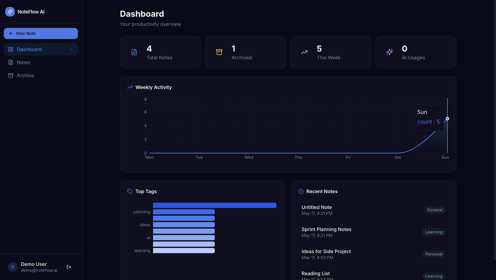
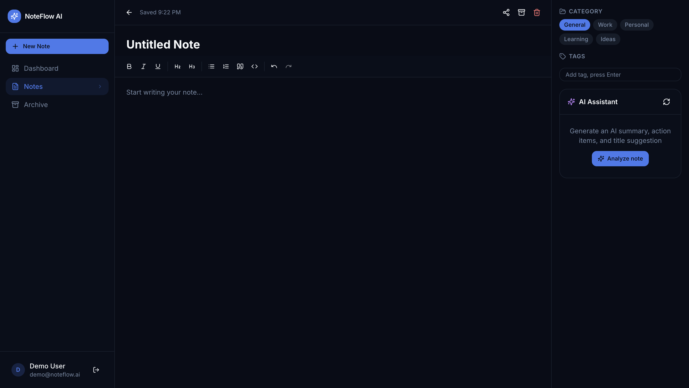
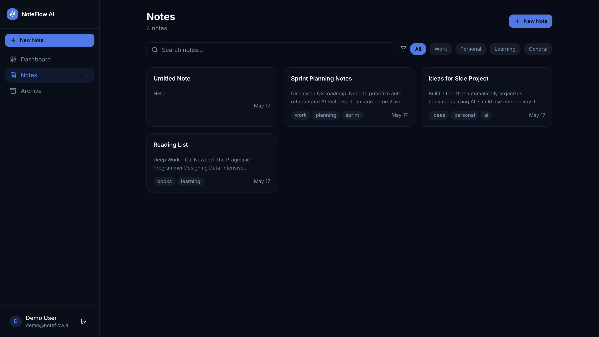
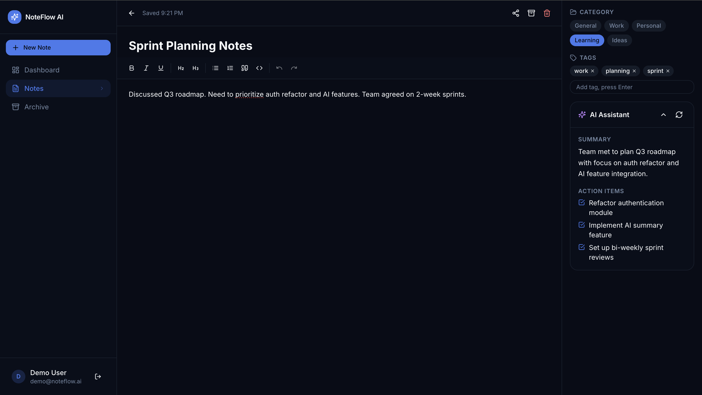

# NoteFlow AI — Collaborative AI Notes Workspace

A modern, full-stack AI-powered notes workspace. Create notes, organize with tags and categories, generate AI summaries and action items, share publicly, and track your productivity — all in a clean, dark-mode-first interface.

---

## Features

- **Authentication** — JWT-based signup/login with bcrypt password hashing
- **Rich Notes Editor** — TipTap rich text editor with debounced autosave
- **AI Integration** — OpenAI-powered note summaries, action items, and title suggestions
- **Search & Filtering** — Full-text search, tag filters, category filters
- **Archive** — Archive/restore notes workflow
- **Public Sharing** — Generate shareable public links for notes
- **Productivity Dashboard** — Weekly activity chart, top tags, AI usage stats
- **Dark Mode** — Dark-first design system with Tailwind CSS
- **Responsive** — Mobile sidebar, adaptive layouts throughout

---

## Tech Stack

| Layer | Technology |
|-------|-----------|
| Frontend | React 18, Vite, TypeScript, Tailwind CSS, Zustand, TipTap, Recharts |
| Backend | Node.js, Express.js, TypeScript, JWT, bcryptjs, Zod |
| Database | MongoDB Atlas via Mongoose |
| AI | OpenAI GPT-4o-mini |
| Deployment | Vercel (frontend) + Render (backend) |

---
## 📸 Screenshots

### Dashboard


### Create New Note


### Notes Section


### Archive Section


### AI Feature


---

## Project Structure

```
noteflow/
├── backend/
│   ├── src/
│   │   ├── config/         # Database connection
│   │   ├── controllers/    # Route handlers
│   │   ├── middleware/     # Auth, error handling
│   │   ├── models/         # Mongoose schemas
│   │   ├── routes/         # Express routers
│   │   ├── services/       # AI service
│   │   ├── utils/          # Seed script
│   │   ├── validators/     # Zod schemas
│   │   └── index.ts        # Entry point
│   ├── .env.example
│   ├── package.json
│   └── tsconfig.json
│
└── frontend/
    ├── src/
    │   ├── components/     # UI, notes, AI components
    │   ├── hooks/          # useNotes, useDebounce
    │   ├── layouts/        # AppLayout
    │   ├── pages/          # All route pages
    │   ├── routes/         # ProtectedRoute
    │   ├── services/       # API service layer
    │   ├── store/          # Zustand stores
    │   ├── types/          # TypeScript types
    │   └── lib/            # cn() utility
    ├── .env.example
    ├── package.json
    └── vite.config.ts
```

---

## Local Setup

### Prerequisites

- Node.js 18+
- MongoDB Atlas account (free tier works)
- OpenAI API key

### 1. Clone the repository

```bash
git clone https://github.com/your-username/noteflow-ai.git
cd noteflow-ai
```

### 2. Backend setup

```bash
cd backend
cp .env.example .env
# Fill in your values in .env
npm install
npm run dev
```

Backend runs on `http://localhost:5000`

### 3. Frontend setup

```bash
cd frontend
cp .env.example .env
# VITE_API_URL=http://localhost:5000/api
npm install
npm run dev
```

Frontend runs on `http://localhost:5173`

### 4. Seed demo data (optional)

```bash
cd backend
npm run seed
# Demo account: demo@noteflow.ai / password123
```

---

## Environment Variables

### Backend `.env`

```
PORT=5000
MONGODB_URI=mongodb+srv://<user>:<pass>@cluster.mongodb.net/noteflow
JWT_SECRET=your_32_char_secret_here
OPENAI_API_KEY=sk-...
CLIENT_URL=http://localhost:5173
NODE_ENV=development
```

### Frontend `.env`

```
VITE_API_URL=http://localhost:5000/api
```

---

## API Overview

```
POST   /api/auth/signup              Register
POST   /api/auth/login               Login
GET    /api/auth/me                  Current user

GET    /api/notes                    List notes (search, tag, category, archived)
POST   /api/notes                    Create note
PATCH  /api/notes/:id                Update note
DELETE /api/notes/:id                Delete note
POST   /api/notes/:id/generate-ai    AI analysis
POST   /api/notes/:id/share          Generate share link
DELETE /api/notes/:id/share          Revoke share link

GET    /api/dashboard/stats          Dashboard statistics

GET    /api/shared/:shareId          Public shared note (no auth)
```

---

## Deployment

### Frontend → Vercel

1. Push `frontend/` to a GitHub repo
2. Import into Vercel
3. Set `VITE_API_URL=https://your-backend.onrender.com/api`
4. Deploy

### Backend → Render

1. Push `backend/` to a GitHub repo
2. Create a new Web Service on Render
3. Build command: `npm install && npm run build`
4. Start command: `node dist/index.js`
5. Add all environment variables
6. Deploy

---

## Sample API Responses

### POST /api/notes/:id/generate-ai

```json
{
  "success": true,
  "summary": "Weekly sprint planning session covering Q3 roadmap priorities...",
  "action_items": [
    "Prepare UI mockups for new dashboard",
    "Review API structure with backend team"
  ],
  "suggested_title": "Sprint Planning — Q3 Roadmap Review"
}
```

### GET /api/dashboard/stats

```json
{
  "success": true,
  "stats": {
    "totalNotes": 12,
    "archivedNotes": 3,
    "weeklyNotes": 4,
    "aiUsageCount": 7,
    "recentNotes": [...],
    "topTags": [{ "tag": "work", "count": 5 }],
    "weeklyActivity": [{ "date": "2026-05-10", "count": 2 }]
  }
}
```

---

## Architecture Notes

- **Autosave**: The editor debounces content and title changes by 1 second before calling the API, preventing excessive requests while the user types.
- **Optimistic updates**: Archive and delete operations update the Zustand store immediately before the API call resolves, with rollback on failure.
- **AI content**: All AI calls happen server-side, keeping the OpenAI key secure. Usage is tracked in the `AIUsage` collection.
- **Public sharing**: Notes generate a UUID `shareId`. The `/shared/:shareId` route requires no authentication and returns only public fields.
- **MongoDB indexes**: Text indexes on `title`, `content`, `tags` for full-text search; compound indexes on `userId + isArchived` for fast list queries.
